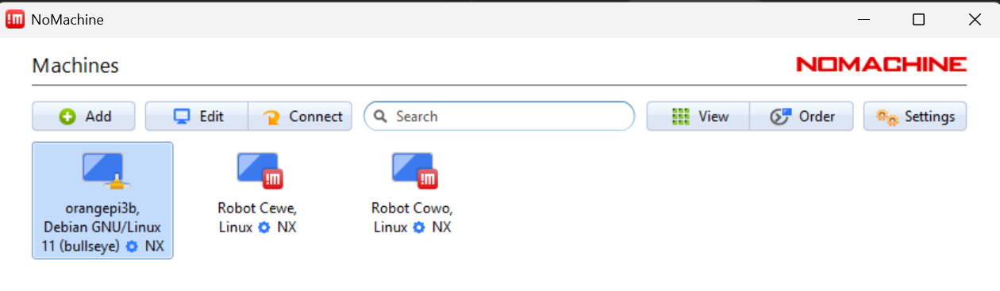

# Instalasi Software

## Computer Setup
OrangePI 3B

# OS Instalation
## Prepare the required for instalation
1. TF card, class 10 or above high-speed SanDisk/SamsungEvo card with a minimum capacity of 32Gb (Recomended 64 GB).
2. TF card reader, used to burn the image into the TF card.
3. Monitor/ Display with HDMI Interface.
4. HDMI to HDMI Cable.
5. Power adapter, Orange Pi 3B is recommended to use 5V/3A Type-C power supply for
power supply.
6. Mouse and keyboard with USB interface for development orangepi.
7. 5V cooling fan as a board cooler

## Orange Pi Installation
How to install OS and GPIO OrangepI 3B can be read in [OrangePI 3B manual book](https://drive.google.com/file/d/1i479ucxErqjL0GDakb5Bw85ptgnDf_Sc/view?usp=drive_link), or you can follow the instruction bellow:

### How to Install Orange Pi 3B:


1. Install [balenaEtcher](https://etcher.balena.io/#download-etcher)
2. Download the Operating System (Debian Image) from the official Orange Pi website, then select and download `Orangepi3b_debian_bullseye_desktop_xfce_linux5.10.160.7z` from the following [Google Drive link](https://drive.google.com/file/d/1BbHfNSJhu4WRcl8Psyy2vFvppGlToEH_/view?usp=drive_link)
3. Extract the downloaded file and wait until the process is complete
4. Open balenaEtcher and select the extracted Orange Pi 3B directory by choosing `Flash from file`
5. In the `Select target` option, choose the SD Card to be used, then press `Select`
6. Press the `Flash` button to start the installation or booting process for Orange Pi 3B and wait until it is finished
7. The Orange Pi 3B installation is now complete
8. Next, insert the Orange Pi SD Card into the SD card slot on the Orange Pi 3B
9. Power on the Orange Pi 3B and check whether the WiFi is available on the Orange Pi
11. Open the terminal and run the following command to upgrade all system packages:
```bash
sudo apt update && sudo apt upgrade -y
```

### How to Set Up WiringPi on Orange Pi 3B:
Run the following syntax to install dependency packages:
```bash
sudo apt-get update
sudo apt-get -y install git swig python3-dev python3-setuptools
```
Download the WiringOP-Python source code located at `/usr/src/wiringOP-Python`, or you can also download it from GitHub using the following command:
```bash
git clone --recursive https://github.com/orangepi-xunlong/wiringOP-Python -b next
cd wiringOP-Python
git submodule update --init --remote
```
Run the following syntax to compile and install WiringOP-Python on Linux:
```bash
cd wiringOP-Python
python3 generate-bindings.py > bindings.i
sudo python3 setup.py install
```

## NoMachine Installation
Note: A complete guide to installing and setting up NoMachine on Orange Pi can be found on this [website](https://www.nomachine.com/tips-on-how-to-set-up-your-raspberry-pi-for-remote-access-via-nomachine).
### How to Set Up NoMachine on Orange Pi 3B:
1. Connect the Orange Pi 3B to a desktop using an HDMI cable
2. Download [NoMachine for ARMv8 - arm64](https://downloads.nomachine.com/download/?id=112&distro=ARM)
3. `Copy` the downloaded file name and `paste` it into the following command to start the installation process:
```bash
sudo dpkg -i nomachine_4.6.12_1_armv6hf.deb
```
4. On the Orange Pi desktop, go to `Settings` > `Advanced Network Configuration` > `Wired connection 1` > `IPv4 Settings`
5. Select the `Manual` method to manually enter the IP address and input the following:
    - IP Address: `192.168.123.12` (for Male Robot) or `192.168.123.11` (for Female Robot)
    - Netmask: `255.255.255.0 (24)`
6. Click `Save`

## Setting time with the current time
run the command below at terminal (Ctrl+Alt+T) to adjust the time "yyyy-mm-dd hh:mm:ss"
```
sudo timedatectl set-time "2024-04-12 09:50:00"
```

## Update System
run the command below at terminal (Ctrl+Alt+T) to update and upgrade system
```
sudo apt update
sudo apt upgrade
```

## Install Terminator
split horizontally, split vertically, etc, on the terminal as one in a single window.
```
sudo apt install -y terminator
```
# Getting the Code Release up and Running

## Installing Dependencies
you need to install the dependencies: the software/libraries required to compile/run the Barelang7 code.
run the following command in the terminal (Ctrl+Alt+T) one at a time:
```
sudo apt-get install libncurses5-dev screen
sudo apt-get install build-essential wget subversion cmake swig libreadline6-dev g++ lua5.1
```
## Download and Install Boots Library
```
mkdir Libraries_Barelang7
cd Libraries_Barelang7
```
Download the latest version of boost from [Here](https://www.boost.org/) (In this case boost_1_84_0.tar.gz). Copy the archive onto the robot directory. Make sure you are in the correct directory of the Robot (Libraries_Barelang7)
```
tar -xvf boost_1_84_0.tar.gz
sudo mv boost_1_84_0 /usr/local/
cd /usr/local/include
sudo ln -s /usr/local/boost_1_84_0/boost boost 
cd -
```
## Downloading and Installing Lua Header Files/Dependencies
```
wget http://www.lua.org/ftp/lua-5.1.4.tar.gz
tar -xvf lua-5.1.4.tar.gz
cd lua-5.1.4
make clean
make linux
sudo make install
cd ..
sudo apt install git
sudo apt install luarocks
sudo luarocks install luasocket
sudo luarocks install struct
```
## Install Source Code
Open the Barelang 7 Source code and look for the `Lib` outside the `player`. Run following command in the terminal:
```
cd Lib
make clean
make setup_op
```
### BNO055 & SSD1306 Installation
Note: Before starting the installation, ensure that the required I2C Orange Pi configuration is enabled. 

Follow these steps before installing the `IMU` sensor and `LCD OLED` on Orangepi 3B

1. Connect `IMU` and `LCD OLED` to the `Orange Pi`
2. Access the Orange Pi desktop using `NoMachine`

3. `Update` and `upgrade` the system first
```bash
sudo apt update && sudo apt upgrade -y
```
4. Ensure that I2C Orange Pi configuration is enabled by running the following command in the terminal
```bash
sudo orangepi-config
```
5. Select `System` > `Hardware` and ensure that I2C2 and I2C3 are enabled

6. Click `Save` > `Back` > `Reboot`
7. Reaccess the Orange Pi desktop and check whether I2C2 and I2C3 are enabled by running the following commands
```bash
sudo i2cdetect -y 2
sudo i2cdetect -y 3
```
8. Run the following command to upgrade all system packages
```bash
sudo apt update && sudo apt upgrade -y
```

## Setting Up BNO055 on Orange Pi 3B:
Download Adafruit BNO055 library from GitHub using the following command
```bash
git clone https://github.com/adafruit/Adafruit_CircuitPython_BNO055.git
```
Go to Adafruit directory and install the library using the following syntax
```bash
cd Adafruit_CircuitPython_BNO055/
sudo python3 adafruit_bno055.py docs install
```
Before running the IMU program, install the necessary libraries: `adafruit_bno055.mpy`, `adafruit_bus_device`, and `adafruit_register`
```bash
pip3 install --upgrade adafruit-circuitpython-bno055 adafruit-circuitpython-busdevice adafruit-circuitpython-register
```
To run the IMU / BNO program, navigate to the `Program_B7_v1_R1` directory and execute `button_imu.py` using the following command in the terminal
```bash
cd ..
cd Documents/Program_B7_v1_R1/
python3 IMU_BNO.py
```

## Setting Up OLED on Orange Pi 3B:
Install the required packages
```bash
sudo apt-get install -y python-imaging python-smbus i2c-tools
```
Restart the computer system
```bash
sudo reboot
```
Download the Adafruit SSD1306 library from GitHub using the following command
```bash
sudo python -m pip install --upgrade pip setuptools wheel
git clone https://github.com/adafruit/Adafruit_Python_SSD1306.git
```
Navigate to the Adafruit directory:
```bash
cd Adafruit_Python_SSD1306
```
Install the library using the following syntax:
```bash
sudo python setup.py install
sudo apt-get install -y python3-pip python3-dev build-essential libz-dev i2c-tools
sudo pip3 install luma.oled
```
To test whether the LCD OLED is working, go to the `oled` directory in `Program_B7_v1_R1` and then test by running the `oled_button_dcm.py` program
```bash
cd /home/orangepi/Documents/Program_B7_v1_R1/oled/
sudo python3 oled_button_dcm.py
```


## Persistance USB
Note: In this section, all robot sub-controller should be active and must be connected to pc.

Run the following command in the terminal.
Identify sub-controller serial for each ttyUSB0 and ttyUSB1:
```
udevadm info -a -n /dev/ttyUSB0 | grep '{serial}' | head -n1 
udevadm info -a -n /dev/ttyUSB1 | grep '{serial}' | head -n1
cd /etc/udev/rules.d
sudo nano Barelang7.rules
```
and following:
```
SUBSYSTEM=="tty", ATTRS{idVendor}=="0403", ATTRS{idProduct}=="6001", ATTRS{serial}=="AH03PJVL", SYMLINK+="CM730" // all value is unique
SUBSYSTEM=="tty", ATTRS{serial}=="0000:00:14.0", SYMLINK+="strategyUSB" // all value is unique
```
Run the following command in the terminal 
```
sudo usermod -a -G dialout $USER
reboot
```
set permanent latency timer  :
```
sudo su
cd /etc/udev/rules.d
touch B7Latency.rules
echo ACTION==\"add\", SUBSYSTEM==\"usb-serial\", DRIVER==\"ftdi_sio\", ATTR{latency_timer}=\"1\" > B7Latency.rules
sudo udevadm control --reload-rules
sudo udevadm trigger --action=add
```
