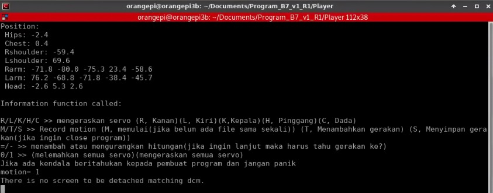
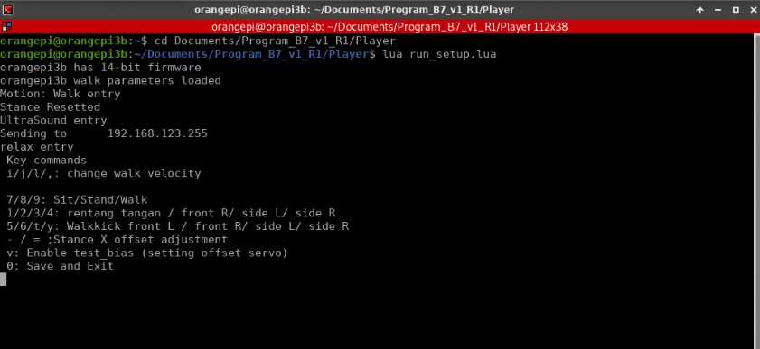

# Tutorial 

## 1. Tutorial Connect Bluetooth


## 2. Tutorial Running the Robot

1. Turn on the Orange Pi 3B.
2. Connect Orange Pi 3B and PC or Laptop in the same Wi-Fi network.
3. Open NoMachine and wait until Orange Pi 3B shows up on the screen.
4. After the Orange Pi 3B show in screen NoMachine, click to inside Orange Pi 3B. 
   
***Note:***

***-  if “Orange Pi 3B” does't appear, click “Search again” in the upper right corner of NoMachine,and then no machine will search again to find “Orange Pi3B”,***

***- If “Orange Pi 3B” is not visible, try to connect it using an ethernet cable plugged into the Orange Pi robot and laptop, then re-open NoMachine.***


### Open Terminal in Orange Pi 3B
  - If it has entered into orange pi 3b, open the terminal by click icon “Application” in the upper left corner, then select and click “Terminal Emulator”. 
  - Once the terminal appears, follow these steps and type on the terminal to go the robot program:
  
  ***Into the document directory***
```
~$ cd Documents
```
  ***Into the robot program directory (the robot used is robot 1)***
```
~$ cd Program B7_v1_R1
```
  ***Into the player directory***
```
~$ cd Player
```

### Running the Program
- Before running the program, turn on servo first by press "switch on" on the back's robot
- Make sure all the LED servo on the robot are lit as indicator of servo on.
- Then, running program for the run robot with type in terminal:
```
~$ sudo python3 activate_button.py
```

**There are 3 mini button and an LCD OLED on the robot's back:**

- DCM button on the right.
- MainOP button on the middle.
- IMU button on the left.

following step to press button:

1. First, push the DCM Button on the robot's back.
2. Secondly, press the Main OP Button.
3. Last, press the button IMU.
   
***After pressing each button, OLED screen will display information that the program is running***

### Running the Robot

  - To start running the robot, press the white button located on the shoulder of the robot, then robot will be in initial positition.
  - Last, press again white button on the shoulder of the robot, then robot will be start dancing.


## 3. Tutorial Record Motion

### Activating Orange Pi 3b via No machine:
1. Open NoMachine on your computer.
2. Ensure that the Orange Pi 3b network and the computer are connected in the same network ***(if not already connected, use a LAN cable to connect between the Orange Pi and the computer)*** and then set to the same network.
3. Once successfully connected, the Orange Pi 3B can be controlled via a computer.


### Record Motion
1. Open a new terminal to run the ***run_RecMotion.lua*** program and start creating the robot's record motion.
2. In the terminal, open the destination file directory to run the ***run_RecMotion.lua*** program by typing the following syntax:
   
```
~$ cd Documents/Program_B7_v1_R1/Player
```

3. Then press **' Enter '**.
4. This will move to the directory containing the ***run_RecMotion.lua*** program.
5. Start running the ***run_RecMotion.lua*** program by typing the following syntax:
   
```
lua run_RecMotion.lua
```
***Note:*** *(When running the program, but the U2D2 indicator is red, there is a problem in serial communication)*

6.  Then press **' Enter '**
7.  Then the ***run_RecMotion.lua*** program will run in the terminal and display the following information:
    

8.  From the information displayed on the terminal, pay attention to the instructions displayed to start recording the robot's movements.
9.  Start recording the robot's movements by clicking several buttons according to the information in the terminal.
10.  When the **‘M’** button is pressed the recording process will start and the program will open a new file called ***tari_oleg.lua*** and initialise the first movement.
11.  Then when the **‘T’** button is pressed, it will automatically add motion and record the servo value in the ***tari_oleg.lua*** file.
12.  When the **‘S’** button is pressed it will save the movement into the ***tari_oleg.lua*** file and will close the program after the last program save.
13.  When you have recorded the motion, stop the ***run_RecMotion.lua*** program by pressing Ctrl+C.
14.  To view the recorded motion program, from the current directory open the ***tari_oleg.lua*** file in the terminal by typing the following syntax:
    
```
~$ geany tari_oleg.lua
```

***Note:*** *(Current directory **~$ cd Documents/Program_B7_v1_R1/Player**)*
15.  This will open the program view in the ***tari_oleg.lua*** file.
16.  Copy all the program content from the file ***tari_oleg.lua*** and paste it into a file called ***LongLeft.lua***.
17.  To enter the ***LongLeft.lua*** file from the current directory, type the following syntax into the terminal:
   
```
~$ cd Motion/keyframes
```

  ***Note:*** *(Current directory **~$ cd Documents/Program_B7_v1_R1/Player**)*
18.  Then press **' Enter '**
19.  Paste the contents into the ***LongLeft.lua*** file and save it.
20.  To view the motion records of the robot, run the ***run_setup.lua*** program.
21.  To run the ***run_setup.lua*** program, move to the **‘Player’** directory of the current directory by typing the following syntax on the terminal:
   
```
~$ cd ../..
```

  ***Note:*** *(Current directory **~$ cd Documents/Program_B7_v1_R1/Player/Motion/keyframe**)*
22.  Then press **' Enter '**
23.  Start running the ***run_setup.lua*** program by typing the following syntax:

```
lua run_setup.lua
```

24.  Then press **' Enter '**
25.  Then the ***run_setup.lua*** program will run in the terminal and display the following information:                                                                  
   
26. To view the recorded motion of the robot, press 1 to view the initial motion and press 2 to view the previously recorded motion of the robot. 
27. Finish


## 4. Tutorial Tunning Robot

1. Turn on the Orange Pi 3B.
2. Open emulator terminal contained in tab application GUI Orange Pi.
3. After the terminal is opened, can go to directory to run the program ***run_dcm.lua*** by running this syntax:
    ```
    ~$ cd /Document/Program_B7_R1/Player
    ```
    In this section is Robot 1 (R1). Then, click enter.

4. Successfully move to the directory for running the program ***run_dcm.lua***.
5. Before run the program ***run_dcm.lua*** must on servo first by pressing the on swith on the back of robot.
6. After the switch is on, the servo will turn on led synchronously indicating that all servos are active.
7. Next, can run the program ***run_dcm.lua*** by running this syntax: 
    ```
    ~$ lua run_dcm.lua
    ```
    Then, click enter.
8. If run the program is successfully, U2D2 will indicator display a green color (Tx) and blue color (Rx) indicating that the program is running well. 
9.  Open the terminal for running the program ***run_setup.lua***.
10. Move to the directory for running the program ***run_setup.lua*** by running this syntax:
    
    ```
    ~$ cd /Document/Program_B7_R1/Player
    ```
    Then, click enter.
11. Successfully move to the directory for running the program ***run_setup.lua*** by running this syntax:
    
    ```
    ~$ lua run_setup.lua
    ``` 
    Then, click enter.
12. After the program is running, make a robot in a standing position by clicking: 
**v (set the servo position at point 0), b (enable test_walk), 8 (stand)**
13. Next, click **9 (walk)** in the keyboard to see the robot walking in place because the velocity is 0.
14. To make the robot walks forward, click **ii** on the keyboard for add the velocity in the robot.
14. If the robot can't walk properly or robot foot stomps, can the robot tunning by click **v** on the keyboard to make standing upright the robot position on the servo in point 0.
15. Then, make the adjustment to the joints of the robot by adjusting the:
1 and 2 (changing the joint points)
a and d (adding and subtracting values at the right foot joint)
w and x (adding and subtracting values at the left foot joint). The joints that are set are:
    - angkle_pitch,
    - angkle_roll,
    - knee_pitch,
    - hip_pitch,
    - hip_roll,
    - hip_yaw

    according to the robot's needs.

  
